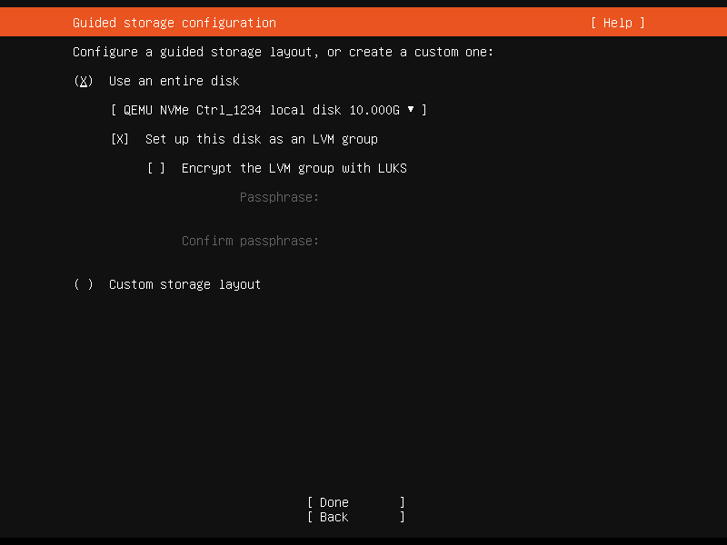
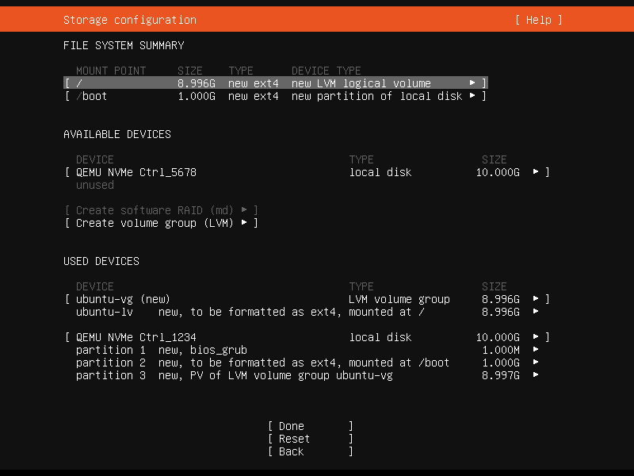
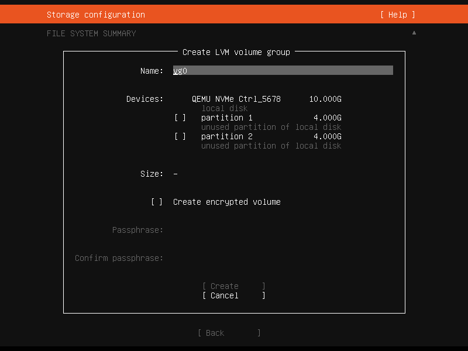

.. _configure-storage:

Configuring storage
*******************

There are a lot of options for storage configuration with the Subiquity
installer. This guide will walk you through some of the common options for an
Ubuntu Server installation.

Guided options
==============

Selecting "Use an entire disk" on the Guided storage configuration screen will
install Ubuntu onto the selected disk, replacing any partitions or data already
there.

You can choose whether or not to set up LVM, and if you do, whether or not to
encrypt the volume with LUKS. If you encrypt the volume, you need to choose a
passphrase that will need to be entered each time the system boots.

If you select "Custom storage layout", no configuration will be applied to the
disks.

In either case, the installer moves onto the main storage customisation screen.

The main storage screen
=======================

This screen presents a summary of the current storage configuration. Each
device or partition of a device corresponds to a different row (which can be
selected), and pressing :kbd:`Enter` or :kbd:`space` while a device is selected
opens a menu of actions that apply to that device.

Partitions
==========

.. image:: figures/configure-storage-partitions.png
   :alt:

To add a partition to a device, select "Add GPT Partition" for that device.

.. image:: figures/configure-storage-GPT-partition.png
   :alt:

You can leave "Size" blank to use all the remaining space on the device.

RAID
====

.. image:: figures/configure-storage-raid.png
   :alt:

`Linux software RAID <https://raid.wiki.kernel.org/index.php/Linux_Raid>`_
(where RAID stands for "Redundant Array of Inexpensive Disks") can be used to
combine several disks into a single device that is (usually) tolerant to any
one disk failure.

A software RAID device can be created out of entire disks or unformatted
partitions. Select the "Create software RAID ("MD")" button to open the
creation dialog.

The server installer supports devices with RAID level 0, 1, 5, 6 or 10 being
created. It does not allow customising other options such as metadata format or
RAID10 layout at this time. See the
`Linux RAID documentation <https://raid.wiki.kernel.org/index.php/Linux_Raid>`_
for more details.

A software RAID device can be formatted and mounted directly, can be
partitioned into several partitions, and can even be used as part of another
RAID device or LVM volume group.

Logical Volume Manager (LVM)
============================

The LVM is a system of managing logical volumes, or file systems, that is much
more advanced and flexible than the traditional method of partitioning a disk
into one or more segments and formatting that partition with a file system. It
can be used to combine several disks into one larger pool of storage but it
offers advantages even in a single disk system, such as snapshots and easy
resizing of logical volumes.

As with RAID, a LVM volume group can be created out of entire disks or
unformatted partitions. Select the "Create LVM volume group" button to open
the creation dialog.

Once a volume group has been created, it can be divided into named logical
volumes which can then be formatted and mounted. It generally makes sense to
leave some space in the volume group for storage of snapshots and creation of
more logical volumes as needed.

The server installer does not supported configuring any of the many, many
options that LVM supports when creating volume groups and logical volumes.

Selecting boot devices
======================

.. image:: figures/configure-storage-boot-devices.png
   :alt:

On all architectures other than s390x, the bootloader needs to be installed to
a disk in such a way that the system firmware can find it on boot. By default,
the first device to have a partition created on it is selected as a boot device
but this can be changed later.

On amd64 and arm64 systems, multiple disks can be selected as boot devices,
which means a system can be configured so that it will continue to boot after
a failure of any one drive (assuming the root file system is placed on a RAID).
The bootloader will be installed to each of these drives, and the operating
system configured to install new versions of GRUB to each drive as it is
updated.

amd64 systems use GRUB as the bootloader. amd64 systems can boot in either UEFI
or legacy (sometimes called "BIOS") mode (many systems can be configured to
boot in either mode) and the bootloader is located completely differently in
the two modes.

Legacy mode
-----------

In legacy mode, the bootloader is read from the first "sector" of a hard drive
(exactly which hard drive is up to the system firmware, which can usually be
configured in a vendor-specific way). The installer will write GRUB to the
start of all disks selected as a boot devices. As GRUB does not entirely fit
in one sector, a small unformatted partition is needed at the start of the
disk, which will automatically be created when a disk is selected as a boot
device (a disk with an existing GPT partition table can only be used as a boot
device if it has this partition).

UEFI mode
---------

In UEFI mode, the bootloader loaded from a "EFI System Partition" (ESP), which
is a partition with a particular type GUID. The installer automatically creates
an ESP (with minimum size 538 MiB) on a disk when it is selected as a boot
device and will install GRUB there (a disk with an existing partition table can
only be used as a boot device if it has an ESP -- bootloaders for multiple
operating systems can be installed into a single ESP). UEFI defines a standard
way to configure the way in which the operating system is chosen on boot, and
the installer uses this to configure the system to boot the just-installed
operating system. One of the ESPs must be mounted at ``/boot/efi``.

Supported arm64 servers boot using UEFI, and are configured the same way as an
UEFI-booting amd64 system.

ppc64el systems also load their bootloader (Petitboot, a small Linux kernel)
from a PReP (PowerPC Reference Platform) partition with a special flag, so in most ways they are similar
to a UEFI system. The installer only supports one PReP partition at this time.

Limitations and workarounds
===========================

Currently, the installer cannot **edit** partition tables. You can use existing
partitions or reformat a drive entirely, but you cannot (for example) remove a
large partition and replace it with two smaller ones.

The installer allows the creation of LVM volume groups and logical volumes and
MD raid devices, but does not allow tweaking of the parameters -- for example,
all logical volumes are linear and all MD raid devices use the default metadata
format (1.2).

These limits can both be worked around in the same way: drop to a shell and use
the usual shell commands to edit the partition table or create the LV or RAID
with desired parameters, and then select these partitions or devices as mount
points in the installer. Any changes you make while the installer is running
but before altering the storage configuration will reflected in the installer.

The installer cannot yet configure iSCSI mounts or BTRFS subvolumes.
