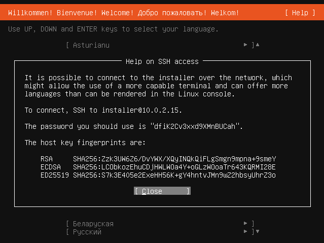

.. _subiquity-security-overview:

Subiquity security overview
===========================

This explanation covers several security-related topics for the Subiquity and
Ubuntu-desktop-bootstrap installation ISO images.

About the installer user
------------------------

At installation time, the default user should be considered to have root
privileges.  The installation system must be able to make arbitrary changes to the
target system, so that the installation can complete successfully.  Additionally,
there is an ``NOPASSWD`` entry in the :file:`/etc/sudoers.d` for the default user, which
means that the default installer user can become root at any time with a
:command:`sudo` invocation.

Ubuntu-server ISO is listening by default with a random password
----------------------------------------------------------------

The Ubuntu Server ISO offers SSH access to the installation system to
facilitate the following installation use cases:

* The installation needs to start over a minimal serial line, which may not
  be capable of running the installer user interface; in that case, the SSH
  access information is printed on that serial line.

* The user prefers using SSH access to interact with the installer interface
  (for example, for richer language support).

Additionally, from the Subiquity UI, one can see the SSH access information by
navigating to the :guilabel:`Help -> Help on SSH Access` menu item.

Note that a default password is never used. Instead, a 20-character random
password is generated and is unique to that given boot of the installer.

Ubuntu Desktop and Ubuntu flavours do not have the SSH server installed by
default.

Security updates are installed if Ubuntu archive access is available
--------------------------------------------------------------------

One of the last steps performed by the Subiquity and Ubuntu-desktop-bootstrap
installers is to use ``unattended-upgrades`` to apply updates to the target
system.  Security updates are always applied if the installer has network
access to the Ubuntu archive.  Optionally, non-security updates can be
configured to be applied before first boot when using ``autoinstall``
:ref:`ai-updates` with the value ``all``.

Details on encrypted installations
----------------------------------

LVM
^^^

To implement full disk encryption in the style referred to as LVM, three
partitions are created:

1. A bootloader partition.
2. An Ext4 partition mounted at :file:`/boot`.
3. A partition used as the :manpage:`cryptsetup(8)`
   device.  The resulting LUKS-encrypted block device is then used as the LVM physical device
   for the volume group, and the rootfs is created in a logical volume.

The configured passphrase is then used to unlock the LUKS-encrypted device.

Note that while the term "full disk encryption" is used, :file:`/boot` and any data
on the bootloader partition remain unencrypted in this scheme.

ZFS
^^^

ZFS disk encryption in Subiquity and Ubuntu-desktop-installer is a hybrid of
LUKS and ZFS encryption approaches.  In addition to the required bootloader
partition, two pools, ``bpool`` and ``rpool``, are created.

* A LUKS device is created as a ZFS dataset in the ``rpool``.
* The configured passphrase is used to encrypt the LUKS device.
* The real key for the ZFS dataset is contained in the "keystore" LUKS device
  as a simple file.
* The ``rpool`` is decrypted using this simple file inside the encrypted LUKS
  device.
