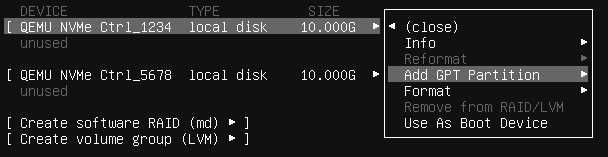
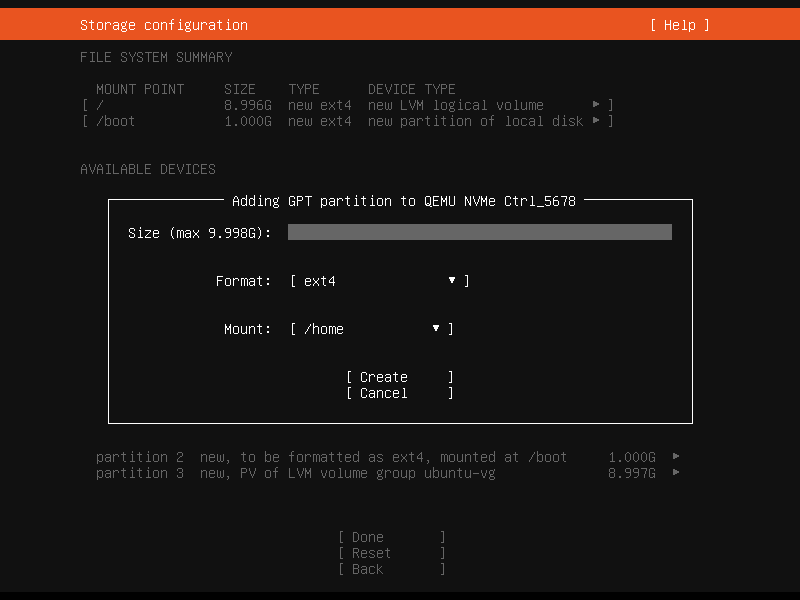
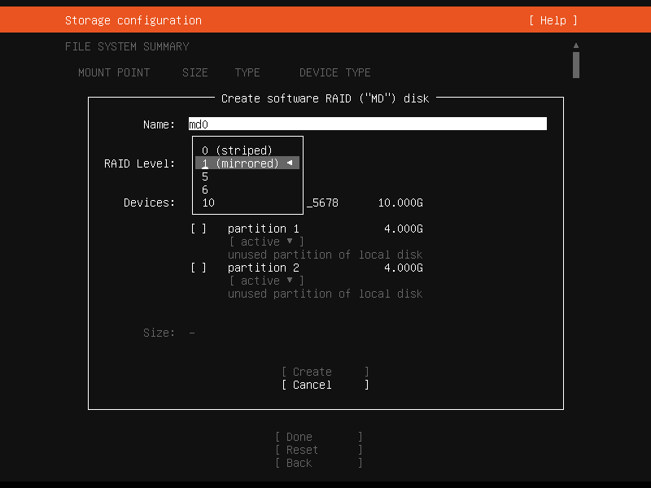
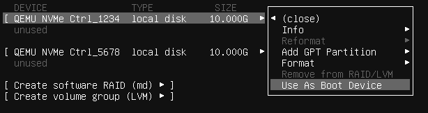

.. _configure-storage:

Configuring storage
===================

This article describes how to use the most common options for storage configuration of the Subiquity installer.

Guided options
--------------

.. image:: figures/configure-storage-guided-options.png
   :alt:

Select :guilabel:`Use an entire disk` on the :guilabel:`Guided storage configuration` screen to install Ubuntu to the selected disk, replacing any partitions or data already there.

You can choose whether or not to set up LVM, and if you do, whether or not to encrypt the volume with LUKS. If you encrypt the volume, choose a passphrase to be entered every time the system boots.

Select :guilabel:`Custom storage layout` to apply no configuration to the disks.

The installer then moves to the main storage customisation screen.

The main storage screen
-----------------------

.. image:: figures/configure-storage-main-screen.png
   :alt:

This screen presents a summary of the current storage configuration. Each device or partition of a device corresponds to a different row (which can be selected). Press :kbd:`Enter` or :kbd:`space` while a device is selected to open a menu of actions that apply to that device.

Partitions
----------

To add a partition to a device, select :guilabel:`Add GPT Partition` for that device.

To use all the remaining space on the device, leave :guilabel:`Size` blank.

RAID
----

`Linux software RAID <https://docs.kernel.org/admin-guide/md.html>`_ (Redundant Array of Independent Disks) can be used to combine several disks into a single device that is (usually) tolerant to any one disk failure.

A software RAID device can be created from entire disks or unformatted partitions. Select the :guilabel:`Create software RAID ("MD")` button to open the creation dialog.

The server installer supports RAID levels 0, 1, 5, 6 and 10. It does not allow customising other options, such as metadata format. See the `Linux RAID documentation <https://docs.kernel.org/admin-guide/md.html>`_ for more details.

A software RAID device can be formatted and mounted directly. It can be partitioned into several partitions, and can be used as part of another RAID device or LVM volume group.

Logical Volume Manager (LVM)
----------------------------

.. image:: figures/configure-storage-lvm.png
   :alt:

LVM is a system of managing logical volumes, or file systems, that is more advanced and flexible than the traditional method of partitioning a disk into one or more segments and formatting that partition with a file system. LVM can be used to combine several disks into one larger pool of storage. It also offers advantages for single-disk systems, such as snapshots and easy resizing of logical volumes.

As with RAID, a LVM volume group can be created from entire disks or unformatted partitions. Select the :guilabel:`Create LVM volume group` button to open the creation dialog.

Once a volume group has been created, it can be divided into named logical volumes, which can then be formatted and mounted. It is recommended to leave some space in the volume group for storage of snapshots and creation of more logical volumes as needed.

The server installer does not support configuring any LVM options for creating volume groups and logical volumes.

Selecting boot devices
----------------------

On all architectures other than s390x, the bootloader needs to be installed to a disk in such a way that the system firmware can find it on boot. By default, the first device to have a partition created on it is selected as a boot device. This can be changed later.

On amd64 and arm64 systems, multiple disks can be selected as boot devices, which means a system can be configured to continue booting after a failure of any one drive (provided the root file system is placed on a RAID). The bootloader is installed to each of these drives, and the operating system configured to install new versions of GRUB to each drive as it is updated.

amd64 systems use GRUB as the bootloader. amd64 systems can boot in either UEFI (Unified Extensible Firmware Interface) or legacy (sometimes called "BIOS") mode (many systems can be configured to boot in either mode). The bootloader is located in different places in the two modes.

Legacy mode
~~~~~~~~~~~

In legacy mode, the bootloader is read from the first "sector" of a hard drive (which hard drive depends on the system firmware, which can usually be configured in a vendor-specific way). The installer writes GRUB to the start of all disks selected as boot devices. As GRUB does not entirely fit in one sector, a small unformatted partition is needed at the start of the disk, which is automatically created when a disk is selected as a boot device (a disk with an existing GPT partition table can only be used as a boot device if it has this partition).

UEFI mode
~~~~~~~~~

In UEFI mode, the bootloader is loaded from an "EFI System Partition" (ESP), which is a partition with a particular GUID type. The installer automatically creates an ESP (with a minimum size of 538 MiB) on a disk when it is selected as a boot device and install GRUB there (a disk with an existing partition table can only be used as a boot device if it has an ESP -- bootloaders for multiple operating systems can be installed into a single ESP).

UEFI defines a standard way to configure the way in which the operating system is chosen on boot, and the installer uses this to configure the system to boot the just-installed operating system. One of the ESPs must be mounted at ``/boot/efi``.

Supported arm64 servers boot using UEFI and are configured the same way as an UEFI-booting amd64 system.

ppc64el systems also load their bootloader (Petitboot, a small Linux kernel) from a PReP (PowerPC Reference Platform) partition with a special flag, so in most ways they are similar to a UEFI system. The installer only supports one PReP partition.

Limitations and workarounds
---------------------------

The installer cannot **edit** partition tables. You can use existing partitions or reformat a drive entirely, but you cannot, for example, remove a large partition and replace it with two smaller ones.

The installer supports the creation of LVM volume groups, logical volumes, and MD RAID (software RAID) devices, but it does not provide a way to configure parameters. For example, all logical volumes are linear and all MD RAID devices use the default metadata format (1.2).

To work around these limitations, switch to a shell and use shell commands to edit the partition table or create the LV or RAID with desired parameters. Then select these partitions or devices as mount points in the installer. Any changes you make while the installer is running but before altering the storage configuration are reflected in the installer.

The installer cannot configure iSCSI mounts or BTRFS subvolumes.
