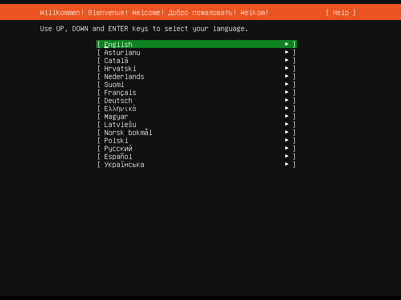

Basic server installation
*************************

This chapter provides an overview of how to install Ubuntu Server Edition. You
can also refer to this guide on
:ref:`how to operate the installer <operate-server-installer>` for more
information on using the installer, and to this
:doc:`screen-by-screen reference guide <screen-by-screen>` for more
information about each of the installer screens.

Preparing to install
====================

This section explains various aspects to consider before starting the
installation.

System requirements
-------------------

Ubuntu Server Edition provides a common, minimalist base for a variety of
server applications, such as file/print services, web hosting, email hosting,
etc. This version supports four 64-bit architectures:

* amd64 (Intel/AMD 64-bit)
* arm64 (64-bit ARM)
* ppc64el (POWER8 and POWER9)
* s390x (IBM Z and LinuxONE)

The recommended system requirements are:

* CPU: 1 gigahertz or better
* RAM: 1 gigabyte or more
* Disk: a minimum of 2.5 gigabytes

Perform a system back up
------------------------

Before installing Ubuntu Server Edition you should make sure all data on the
system is backed up.

If this is not the first time an operating system has been installed on your
computer, it is likely you will need to re-partition your disk to make room
for Ubuntu.

Any time you partition your disk, you should be prepared to lose everything on
the disk should you make a mistake or something goes wrong during partitioning.
The programs used in installation are quite reliable, most have seen years of
use, but they also perform destructive actions.

Download the server ISO
-----------------------

You can obtain the amd64 server download from https://releases.ubuntu.com/.
Select the version you wish to install and select the "server install image"
download. Note that the server download includes the installer.

There are platform-specific how-to guides for installations on:

* `s390x LPAR <https://discourse.ubuntu.com/t/interactive-live-server-installation-on-ibm-z-lpar-s390x/16601>`_
* `z/VM <https://discourse.ubuntu.com/t/interactive-live-server-installation-on-ibm-z-vm-s390x/16604>`_
* `ppc64el <https://discourse.ubuntu.com/t/using-a-virtual-cdrom-and-petitboot-to-start-a-live-server-installation-on-ibm-power-ppc64el/16694>`_

Create a bootable USB
---------------------

There are many ways to boot the installer but the simplest and most common way
is to
`create a bootable USB stick <https://ubuntu.com/tutorials/tutorial-create-a-usb-stick-on-ubuntu>`_
to boot the system to be installed with
(`tutorials for other operating systems <https://ubuntu.com/search?q=%22create+a+bootable+USB+stick%22>`_
are also available). 

Perform the installation
========================

Now that you have prepared your install medium, you are ready to install.

Boot the installer
------------------

Plug the USB stick into the system to be installed and start it.

Most computers will automatically boot from USB or DVD, though in some cases
this is disabled to improve boot times. If you don't see the boot message and
the "Welcome" screen which should appear after it, you will need to set your
computer to boot from the install media.

There should be an on-screen message when the computer starts, telling you what
key to press for settings or a boot menu. Depending on the manufacturer, this
could be :kbd:`Escape`, :kbd:`F2`, :kbd:`F10` or :kbd:`F12`. Restart your
computer and hold down this key until the boot menu appears, then select the
drive with the Ubuntu install media.

If you are still having problems, check out the
`Ubuntu Community documentation on booting from
CD/DVD <https://help.ubuntu.com/community/BootFromCD>`_.

After a few moments, the installer will start in its language selection screen.

Using the installer
-------------------

The installer is designed to be easy to use and have sensible defaults so for
a first install you can mostly just accept the defaults for the most
straightforward install:

* Choose your language
* Update the installer (if offered)
* Select your keyboard layout
* Do not configure networking (the installer attempts to configure wired
  network interfaces via DHCP, but you can continue without networking if this
  fails)
* Do not configure a proxy or custom mirror unless you have to in your network
* For storage, leave "use an entire disk" checked, and choose a disk to install
  to, then select "Done" on the configuration screen and confirm the install
* Enter a username, hostname and password
* On the SSH and snap screens, select "Done"
* You will now see log messages as the install is completed
* Select restart when this is complete, and log in using the username and
  password provided
