Screen-by-screen installer
**************************

The installer is designed to be easy to use without documentation. However,
this guide provides more information on each of the screens of the installer to
help walk you through an installation.

Language selection
==================

.. image:: figures/sbs-language.png
   :alt:

This screen selects the language for the installer and the default language
for the installed system.

More languages can be displayed if you
`connect via SSH <https://discourse.ubuntu.com/t/how-to-operate-the-server-installer/16689#connect-via-ssh>`_.

Refresh
=======

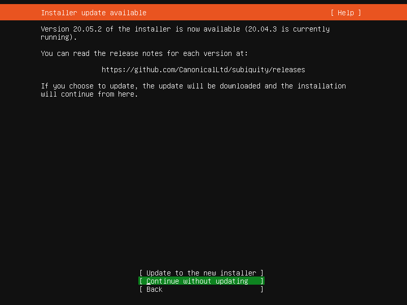

This screen is shown if there is an update available for the installer. This
allows you to get any improvements and bug fixes made since release.

If you choose to update, the new version will be downloaded and the installer
will restart at the same point of the installation.

Keyboard
========

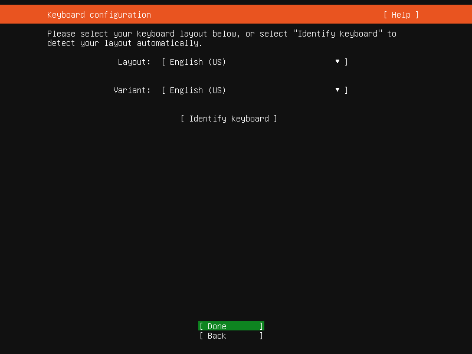

Choose the layout and variant of keyboard attached to the system, if any. When
running in a virtual terminal, it is possible to guess the layout and variant
by answering questions about the keyboard.

Zdev (s390x only)
=================

.. code-block::

    ====================================================================
      Zdev setup                                                      
    ====================================================================
      ID                          ONLINE  NAMES                                  ^
                                                                                             │
      generic-ccw                                                                │
      0.0.0009                                    >                              │
      0.0.000c                                    >                              │
      0.0.000d                                    >                              │
      0.0.000e                                    >                              │
                                                                                 │
      dasd-eckd                                                                  │
      0.0.0190                                    >                              │
      0.0.0191                                    >                              │
      0.0.019d                                    >                              │
      0.0.019e                                    >┌────────────┐                 
      0.0.0200                                    >│< (close)   │                 
      0.0.0300                                    >│  Enable    │                 
      0.0.0400                                    >│  Disable   │                 
      0.0.0592                                    >└────────────┘                v
                                                                                  
                                     [ Continue   ]                               
                                     [ Back       ]                               
                                                                         

This screen is only shown on s390x and allows z-specific configuration of
devices.

The list of devices can be long. :kbd:`Home` / :kbd:`End` / :kbd:`PgUp`
/ :kbd:`PgDn` can be used to navigate through the list more quickly.

Network
=======

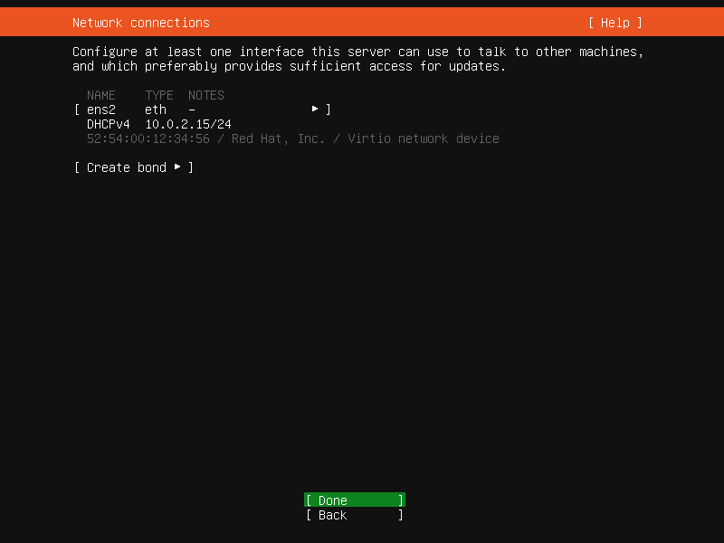

This screen allows the configuration of the network. Ubuntu Server uses Netplan
to configure networking and the UI of the installer can configure a subset of
Netplan capabilities. In particular, it can configure DHCP or static
addressing, VLAN and bonds.

If networking is present (defined as "at least one interface has a default
route") then the installer will install updates from the archive at the end of
installation.

Proxy
=====

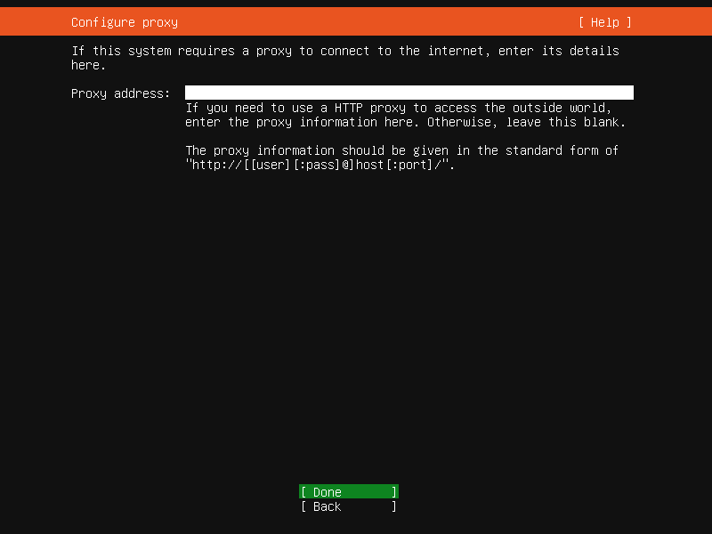

The proxy configured on this screen is used for accessing the package
repository and the snap store both in the installer environment and in the
installed system.

Mirror
======

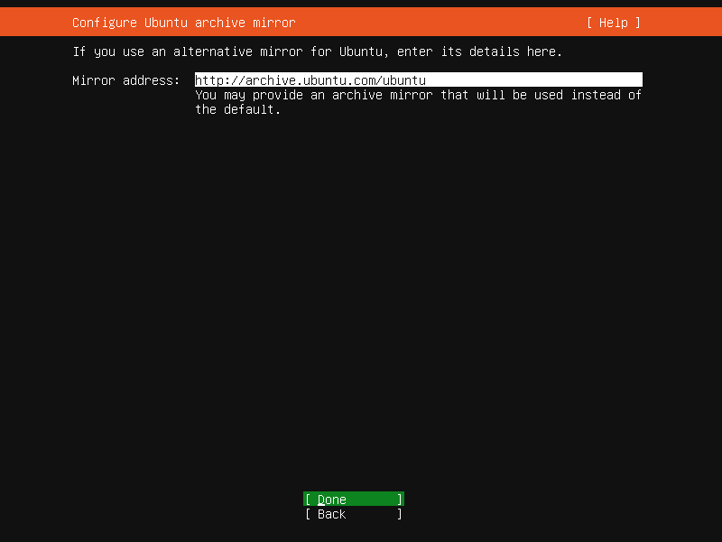

The installer will attempt to use ``geoip`` to look up an appropriate default
package mirror for your location. If you want or need to use a different
mirror, enter its URL here.

Storage
=======

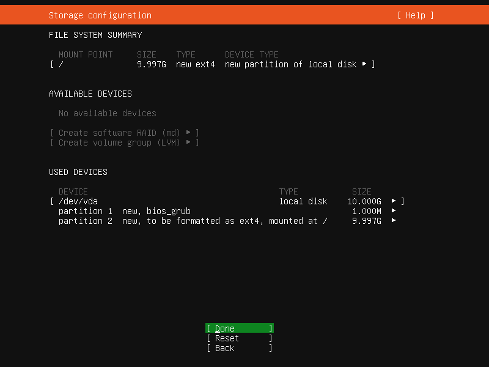

Storage configuration is a complicated topic and :ref:`has its own page for documentation <configure-storage>`.

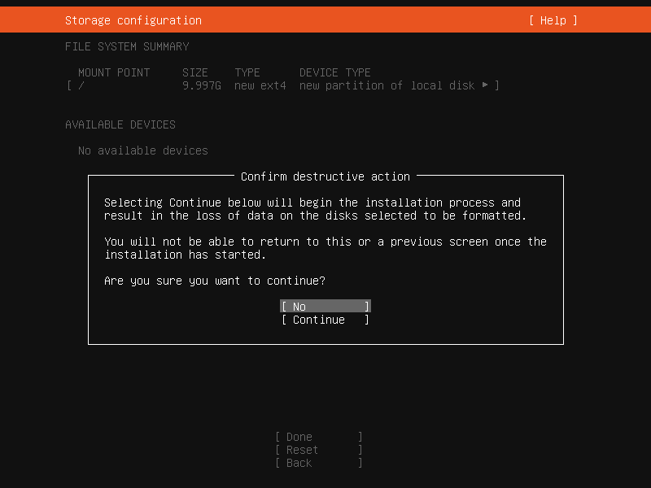

Once the storage configuration is confirmed, the installation begins in the
background.

Identity
========

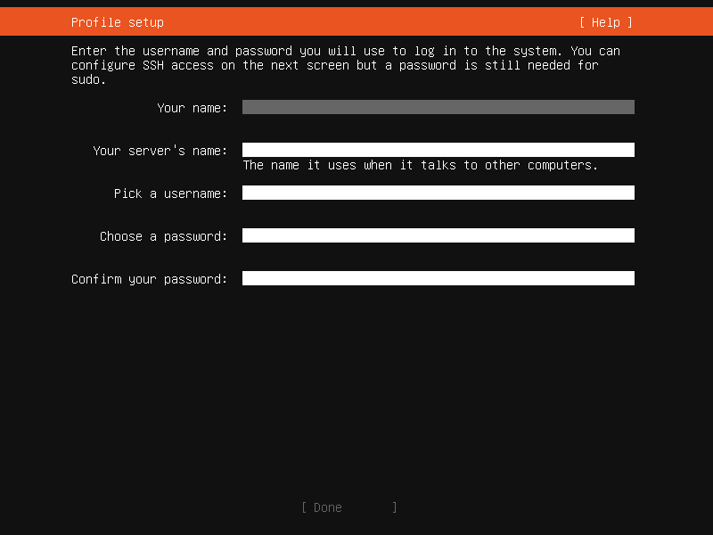

The default user will be an administrator, able to use ``sudo`` (this is why a
password is needed, even if SSH public key access is enabled on the next
screen).

SSH
===

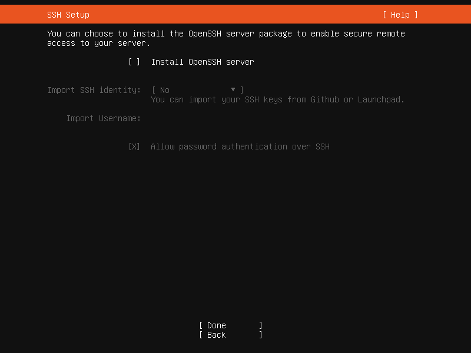

A default Ubuntu installation has no open ports. It is very common to administer
servers via SSH so the installer allows it to be installed with the click of a
button.

You can import keys for the default user from GitHub or Launchpad.

If you import a key, then password authentication is disabled by default but it
can be re-enabled again at a later time if you wish.

Snaps
=====

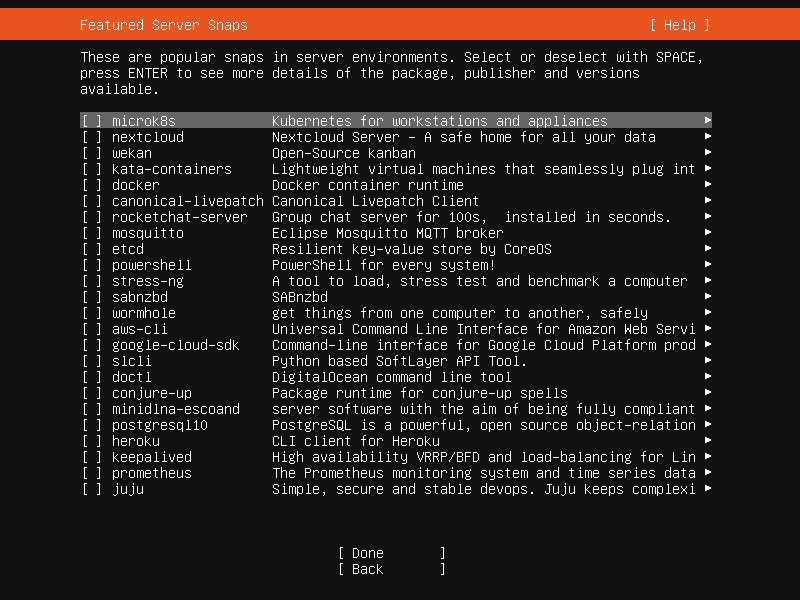

If a network connection is enabled, a selection of snaps that are useful in a
server environment are presented and can be selected for installation.

Installation logs
=================

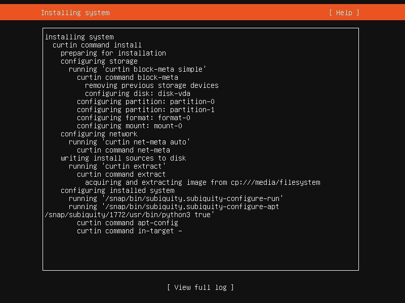

The final screen of the installer shows the progress of the installer and
allows viewing of the full log file. Once the installation has completed and
security updates installed, the installer waits for confirmation before
restarting.

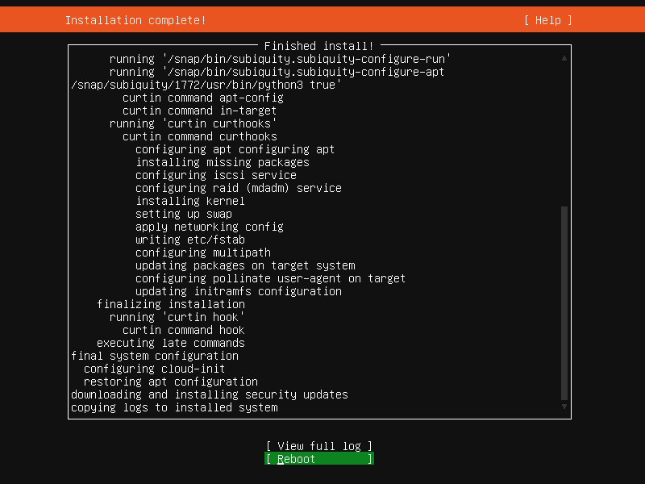

